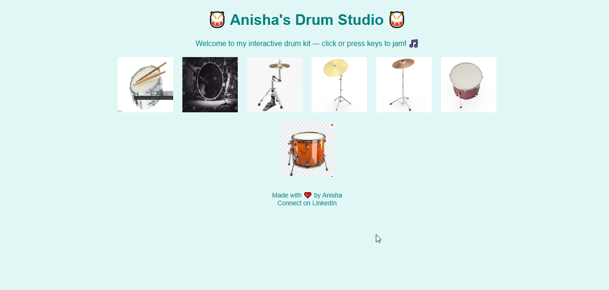

# 🥁 Anisha's Drum Studio

Welcome to **Anisha's Drum Studio**, an interactive virtual drum kit where you can **click** or **press keys** to make music with different drum sounds! 🥁🎶

---

## 🌟 Features

- 🎧 Click on drums or use your keyboard to play sounds
- 💡 Visual feedback when a drum is hit
- 🖼️ Drum images for realistic feel
- 🔑 Key bindings for each drum:
  - `s` = Snare
  - `k` = Kick
  - `h` = HiHat
  - `c` = Crash
  - `r` = Ride
  - `t` = Tom
  - `f` = Floor Tom

---

## 🛠️ Technologies Used

- HTML5
- CSS3 (Flexbox + simple animation)
- JavaScript (DOM manipulation, event listeners)
- Audio API for sound playback

---

## 📸 Preview

> _Click each drum or use your keyboard to create your own rhythm!_

---

## 📂 Project Structure
